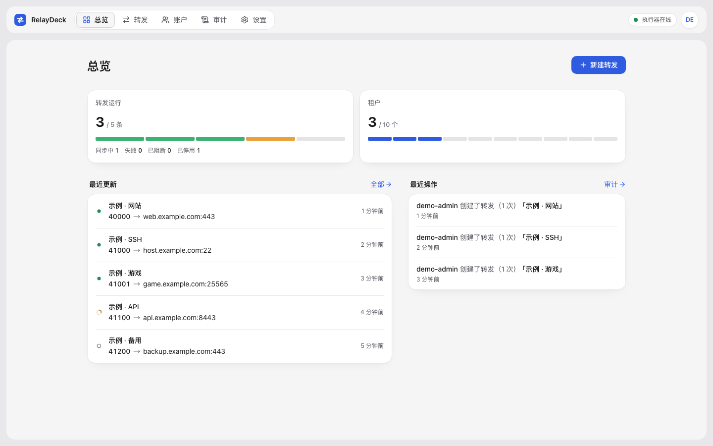
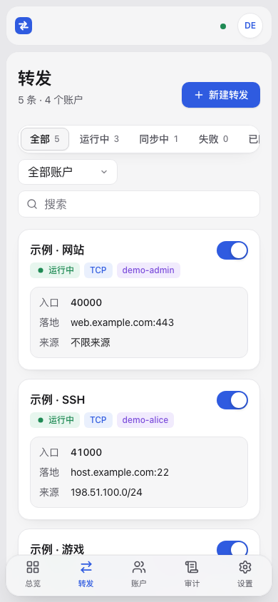

# RelayDeck

单机、多租户的 [Realm](https://github.com/zhboner/realm) 转发面板。Rust 后端，Vue 前端，SQLite 存储。

- TCP / UDP 转发、来源网段限制、域名自动更新。
- 账户端口段、规则额度、有效期；租户仅管理自己的规则。
- MFA、操作审计、独立运行身份、nftables 与 cgroup 隔离。
- 列表 / 卡片、浅色 / 深色、桌面 / 手机。
- 所有者专属面板升级，校验发布包，失败自动回滚。

## 预览

截图使用示例数据。




## 部署

使用 [Releases](https://github.com/JoyceBupt/relaydeck/releases) 中的预编译包；服务器无需 Rust、Node 或 pnpm。首个正式版本尚未发布。

要求：Linux、systemd、cgroup v2、内核 cgroup BPF、Python 3.11+、nftables、iproute2 和 Caddy。发布包基于 Debian 12 构建，支持 x86_64 / ARM64；Realm 2.9.6 独立安装。

下载对应架构的包、校验文件和可信 Realm 二进制，在空目录执行：

```sh
BUNDLE='relaydeck-VERSION-REVISION-x86_64-unknown-linux-gnu.tar.gz'
sha256sum -c "$BUNDLE.sha256"
tar -xzf "$BUNDLE"
sudo python3 deploy/manage.py install \
  --bundle "$BUNDLE" --sha256 "$(cut -d ' ' -f1 "$BUNDLE.sha256")" \
  --realm ./realm --realm-sha256 'REALM_SHA256' \
  --origin https://panel.example.com --admin admin
```

安装时交互设置密码。将 `import /etc/relaydeck/Caddyfile` 加入现有 Caddy 配置，验证后重载；域名指向服务器，开放 80/443 及分配的转发端口。

数据位于 `/var/lib/relaydeck`，配置位于 `/etc/relaydeck`。调整 `broker.json` 中的端口与资源预算以适配主机；systemd 自定义项使用 drop-in。备份需同时保留一致的数据库与 MFA 密钥。

升级入口位于“设置”，仅初始所有者可操作，需密码与 MFA。升级会短暂中断全部转发；修改规则仅重启对应规则。当前最多 10 个租户、全站 30 条规则，无多节点或流量计量。

## 本地开发

需要 Rust 1.99、Node 24+、pnpm 11.18。

```sh
cd frontend && pnpm install --frozen-lockfile && pnpm run build && cd ..
cargo run --locked -- init-admin admin
cargo run --locked -- serve
```

打开 <http://127.0.0.1:7410>。本地可查看与配置界面；实际转发及面板升级需要 Linux 服务。测试：`cargo test --locked --all-targets`、`cd frontend && pnpm test`。

## 协议

[MIT](LICENSE)。第三方组件保留各自许可，发布包附带 `deploy/licenses` 中的声明；Realm 与字体的许可分别保留。
